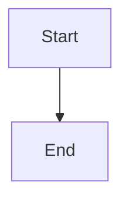

# astro-academic

A typography-driven academic homepage + blog template built with [Astro 5](https://astro.build). Editorial minimalist design — serif headlines, generous whitespace, no card UI. Fork, edit a few files, push to GitHub, and your site is live.

**[Live Demo](https://zhouzenghui.site)** (built from this template)

## Quick Start (5 minutes)

1. **Fork this repo** or click "Use this template"
2. **Edit `src/config.ts`** — your name, social links, site URL
3. **Replace `public/images/profile.jpg`** with your photo
4. **Edit `src/data/*.ts`** — update each file with your info
5. **Write blog posts** in `src/content/blog/`
6. **Push to `main`** — GitHub Actions deploys automatically

## Project Structure

```
src/
├── config.ts              ★ Your one-file config
├── data/                   ★ Edit these — never touch HTML
│   ├── intro.md           About Me (Markdown)
│   ├── education.ts       Education history
│   ├── experience.ts      Work experience
│   ├── news.ts            News items
│   ├── publications.ts    Paper list
│   ├── projects.ts        Research projects
│   ├── honors.ts          Awards & honors
│   ├── services.ts        Academic service
│   └── skills.ts          Skill tags
├── content/blog/           Blog posts (Markdown)
├── components/             Reusable Astro components
├── layouts/                Page layouts
├── pages/                  Route pages
└── styles/global.css       Complete design system
```

## Blog Posts

Create `.md` files in `src/content/blog/` named `YYYY-MM-DD-slug.md`:

```markdown
---
title: "My First Paper"
date: 2025-06-01
excerpt: "A short preview for the blog list."
keywords: ["Research", "AI"]
featured: false
draft: false
---

Content here. Supports **KaTeX**: $E = mc^2$

And **Mermaid** diagrams:


```

## Configuration

Edit `src/config.ts`:

| Field | Purpose |
|-------|---------|
| `site.title` | Your site's title |
| `site.url` | `https://yourname.github.io` |
| `author.name` | Your name |
| `author.avatar` | Path to your photo |
| `homePage.greeting` | Hero headline |
| `googleScholar.enabled` | Enable citation count badges |
| `giscus` | Comment system (optional) |

## Design

- **Binary font system** — Newsreader (serif) for content, Inter (sans-serif) for metadata
- **No cards** — no background colors, no border-radius, no box-shadows
- **Responsive** — single breakpoint at 768px

## Deploy

Push to `main`. GitHub Actions builds and deploys to GitHub Pages. For a custom domain, edit `public/CNAME`.

## License

MIT
