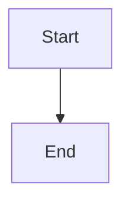

# astro-academic

A typography-driven academic homepage + blog template built with [Astro 5](https://astro.build). Editorial minimalist design — serif headlines, generous whitespace, no card UI. Fork, edit a few files, push to GitHub, and your site is live.

**[Live Demo](https://zhouzenghui.site)** (built from this template)

---

## Quick Start

1. **Use this template** — click the green "Use this template" button on GitHub
2. **Edit `src/config.ts`** — your name, social links, site URL
3. **Replace `public/images/profile.jpg`** with your photo
4. **Edit `src/data/*.ts`** — update each file with your info
5. **Write blog posts** in `src/content/blog/`
6. **Push to `main`** — GitHub Actions deploys automatically

---

## Local Development

```bash
# Install dependencies
npm install

# Start dev server with hot reload
npm run dev
# → http://localhost:4321
# Changes to config.ts, data files, and CSS reflect instantly.

# Build for production
npm run build
# → Output in dist/

# Preview the production build locally
npm run preview
# → http://localhost:4321
```

**Editing workflow:**
1. Run `npm run dev` in the background
2. Edit files in `src/data/` or `src/config.ts`
3. Browser auto-refreshes — see changes immediately
4. When happy, commit and push

---

## Configuration Guide

Edit `src/config.ts`. Every field has a clear purpose:

### `site` — Site identity

| Field | Required | Example | Notes |
|-------|----------|---------|-------|
| `title` | ✅ | `"Your Name"` | Appears in browser tab, SEO, header |
| `description` | ✅ | `"PhD Candidate at..."` | SEO meta description |
| `url` | ✅ | `"https://yourname.github.io"` | Must match your GitHub Pages URL |
| `lang` | — | `"en"` | HTML lang attribute |
| `analyticsId` | — | `"G-XXXXXXXXXX"` | Google Analytics. Leave `""` to disable |

### `author` — Your identity

| Field | Required | Example |
|-------|----------|---------|
| `name` | ✅ | `"Your Name"` |
| `avatar` | ✅ | `"/images/profile.jpg"` |
| `bio` | — | `"PhD Candidate at..."` |
| `email` | — | `"you@university.edu"` |
| `github` | — | `"your-github-username"` |
| `googleScholar` | — | Full Google Scholar profile URL |

Social icons appear automatically when the corresponding fields are filled. Leave a field empty to hide that icon.

### `navigation` — Header links

```typescript
export const navigation = {
  header: [
    { label: "Intro", href: "/about" },
    { label: "Blog", href: "/blog" },
  ],
};
```

Add or remove entries to change the header. Keep it short (2-3 links max).

### `homePage` — Hero section

| Field | Purpose |
|-------|---------|
| `greeting` | Big serif headline |
| `subtitle` | Smaller line below |
| `keywords` | Pill tags below subtitle |

### `googleScholar` — Citation counts

| Field | Default | Notes |
|-------|---------|-------|
| `enabled` | `false` | Set to `true` after configuring the crawler |
| `statsUrl` | `""` | CDN URL for citation JSON (see Scholar section below) |

Citation counts won't show until you set up the crawler and enable this.

### `giscus` — Blog comments

| Field | Example | Notes |
|-------|---------|-------|
| `repo` | `"yourname/yourname.github.io"` | Your GitHub repo |
| `repoId` | From giscus.app | Leave `""` to disable comments |
| `categoryId` | From giscus.app | Leave `""` to disable comments |

Go to [giscus.app](https://giscus.app), fill in your repo, and copy the IDs. Leave both `repoId` and `categoryId` empty to hide the comment section entirely.

---

## About Page Data Files

Edit `src/data/*.ts`. Each file corresponds to a section on the About page.

### `intro.md`
Free-form Markdown. Supports `**bold**` and `[links](url)`.

### `education.ts`, `experience.ts`
```typescript
{ date: "2020 – Present", title: "Ph.D.", school: "Your University", description: "..." }
```

### `publications.ts`
```typescript
{
  heading: "Selected Publications",
  papers: [
    { title: "...", venue: "VENUE", paperId: "USER_ID:XXXXX", authors: "**Your Name**, Co-author" }
  ]
}
```
- `**Your Name**` bolds your name in the author list
- `paperId` is the Google Scholar citation ID — used to fetch citation counts
- `venue` becomes a journal badge

### `honors.ts` and `services.ts`
```typescript
{
  heading: "Section Title",
  items: [
    { date: "2024", level: "University", text: "Award name." },   // honors
    { role: "PC Member", text: "Conference name." }               // services
  ]
}
```

### `projects.ts`
```typescript
{ date: "2020 – 2023", role: "Algorithm Lead", title: "Project Name", description: "...", link?: "https://..." }
```
- `link` is optional. When provided, the title becomes a clickable link.

---

## Blog Posts

Create `.md` files in `src/content/blog/` named `YYYY-MM-DD-slug.md`:

```markdown
---
title: "My First Paper"
date: 2025-06-01
excerpt: "A short preview for the blog list."
keywords: ["Research", "AI"]
featured: false
draft: false
---

Content here. Supports **KaTeX**: $E = mc^2$

And **Mermaid** diagrams:


```

### Frontmatter fields

| Field | Required | Description |
|-------|----------|-------------|
| `title` | ✅ | Post title |
| `date` | ✅ | `YYYY-MM-DD` |
| `excerpt` | — | SEO description and blog list preview |
| `keywords` | — | Pill tags shown below the title |
| `featured` | — | `true` = show as newspaper front-page headline |
| `draft` | — | `true` = skip during build |
| `related` | — | Slugs of related posts (e.g. `["2025-01-15-post-slug"]`) |

---

## Google Scholar Citations

### How it works
1. A GitHub Action (`google_scholar_crawler.yaml`) runs a Python script daily
2. The script scrapes citation counts from Google Scholar
3. Data is pushed to the `google-scholar-stats` branch
4. Served via jsDelivr CDN — no server needed
5. The site fetches it client-side and shows per-paper citation badges

### Setup
1. Copy the `google_scholar_crawler/` directory from the [original repo](https://github.com/MaxwelsDonc/MaxwelsDonc.github.io/tree/main/google_scholar_crawler) into your repo
2. Add the workflow file from `.github/workflows/google_scholar_crawler.yaml`
3. Set `GOOGLE_SCHOLAR_ID` in your repo's Settings → Secrets (your Scholar user ID, e.g. `mrf-JvkAAAAJ`)
4. Update `statsUrl` in `src/config.ts` to point to your CDN URL
5. Set `googleScholar.enabled = true`

---

## Deployment

### GitHub Pages (one push)
1. Go to repo **Settings → Pages**
2. **Source**: select **GitHub Actions**
3. Push to `main` — the `deploy.yml` workflow builds and deploys automatically

### Custom domain
1. Edit `public/CNAME` with your domain (e.g. `yourname.com`)
2. Configure your DNS provider: add a CNAME record pointing to `yourname.github.io`

---

## Common Issues

| Symptom | Cause | Fix |
|---------|-------|-----|
| Build fails "Config validation failed" | Required fields not set | Fill in `site.title`, `site.url`, `author.name` in `src/config.ts` |
| Blog post not showing | `draft: true` | Set `draft: false` |
| About page sections missing | Data file has wrong format | Check TypeScript types — your editor should highlight errors |
| Profile photo not loading | Wrong path or file not replaced | Ensure `public/images/profile.jpg` exists |
| Citations show nothing | `googleScholar.enabled` is `false` | Set to `true` after configuring the crawler |
| Mermaid diagrams not rendering | CDN script loading issue | Check browser console. Diagrams render client-side |
| Deployment runs Jekyll (fails) | Pages source is "Deploy from a branch" | Change to "GitHub Actions" in Settings → Pages |

---

## Design Principles

1. **Binary font system** — Newsreader (serif) for content, Inter (sans-serif) for metadata
2. **No cards** — no background colors, no border-radius, no box-shadows
3. **Hover = color only** — no scale transforms, no shadow changes
4. **Left-aligned** — content spine is the left edge

---

## License

MIT
