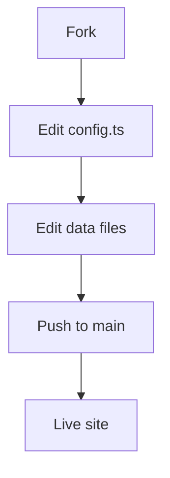

Welcome to your new academic homepage! This template is designed to get you from zero to a fully functional site in minutes.

## Quick Start

1. Edit `src/config.ts` with your name, social links, and site URL
2. Replace `public/images/profile.jpg` with your photo
3. Edit the files in `src/data/` with your own information
4. Write blog posts in `src/content/blog/`
5. Push to GitHub — the site deploys automatically

## Features

- **Editorial design** — serif typography, generous whitespace, no card UI
- **KaTeX math** — inline $E = mc^2$ and block display equations
- **Mermaid diagrams** — flowcharts, sequence diagrams, and more

- **Google Scholar citations** — auto-fetched per-paper citation counts
- **Responsive** — works on mobile and desktop

Edit or delete this post and start writing your own content.
